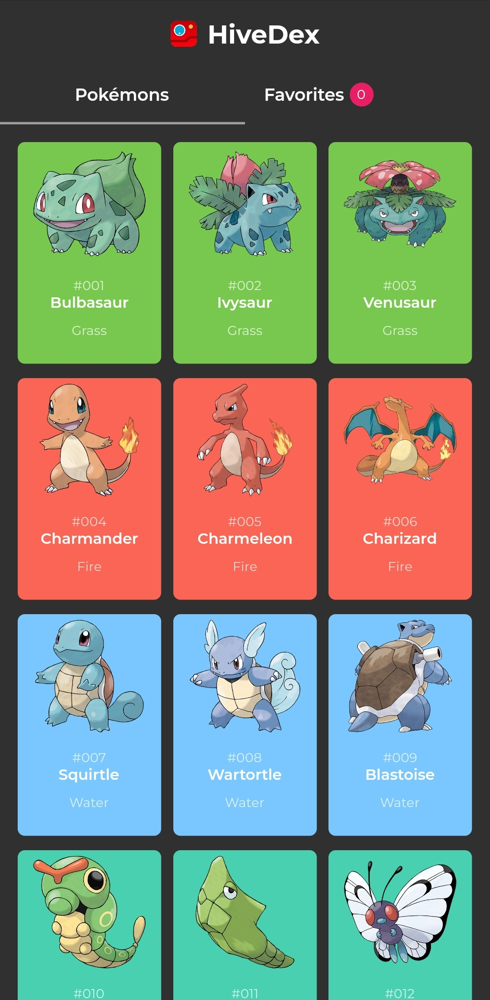
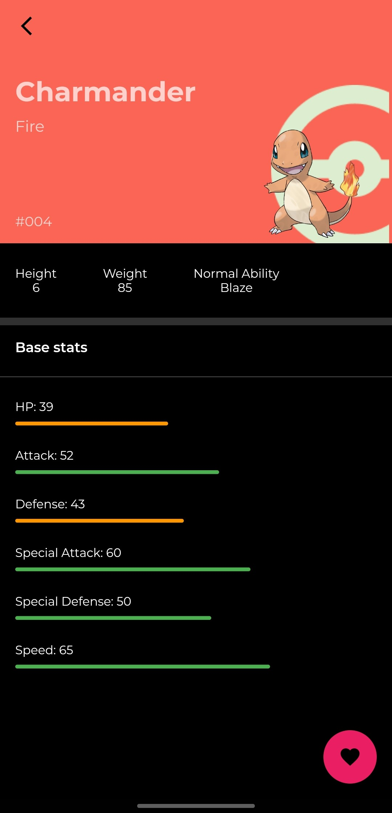
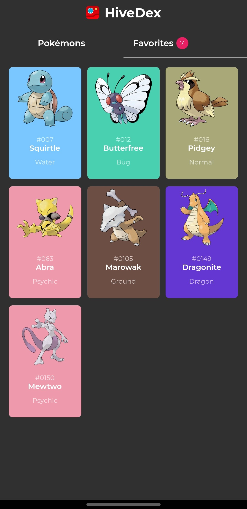
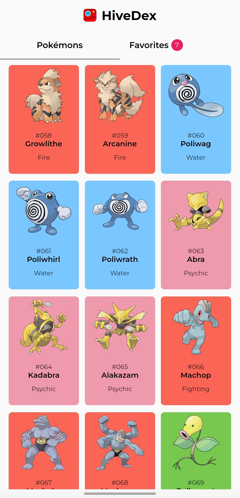
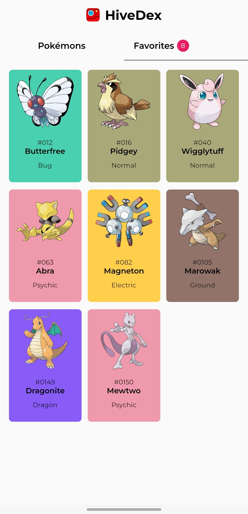
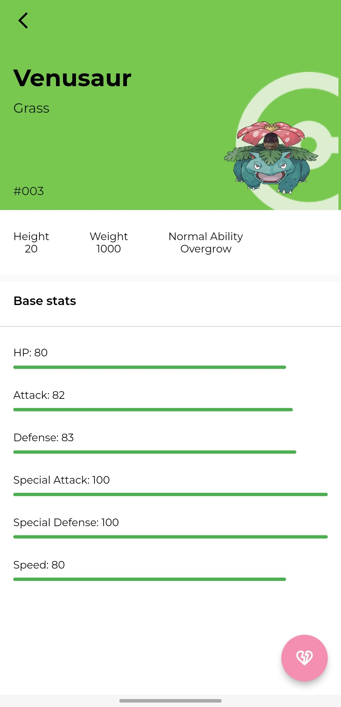

# Docket

## 📱Screens 
  

   </img>
    </img>
     </img>
   
   
    </img>
     </img>
    </img>
  

  

## 🛠 Technology 🚀

This project was developed using PokeAPI, BLoC for state management, Hive for local storage, and the following libraries and technology:

- <a href="https://flutter.dev/">Flutter 3.3.10</a>
- <a href="https://pokeapi.co/">PokeAPI</a>
- <a href="https://pub.dev/packages/flutter_bloc">Flutter Bloc</a>
- <a href="https://pub.dev/packages/hive">Hive</a>
- <a href="https://pub.dev/packages/http">http</a>

## 💻 About

It is a functional complete Pokédex that allows you to view Pokémons' stats and information, and also favorite/unfavorite them.
It also features a dark and light theme.

---
Made with ♥ by Mariugo 🚀
